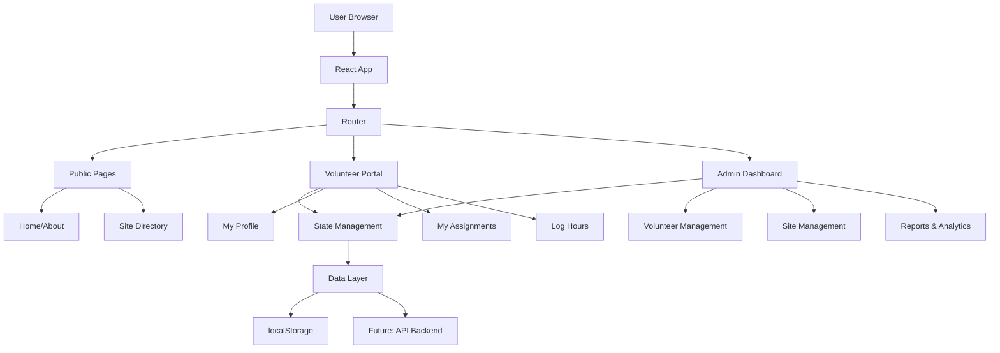

# Tree Care Volunteer Management System - Implementation Plan

## Project Overview

A React-based web application for managing tree care volunteers across multiple sites for a non-profit organization. The system will be deployed on GitHub Pages and provide comprehensive volunteer coordination, site management, and activity tracking capabilities.

## Technology Stack

### Core Technologies
- **Frontend Framework**: React 18+ with TypeScript
- **Build Tool**: Vite (fast, modern, optimized for GitHub Pages)
- **Routing**: React Router v6
- **State Management**: React Context API + useReducer (or Zustand for scalability)
- **Styling**: Tailwind CSS for responsive design
- **UI Components**: Headless UI or Radix UI for accessibility
- **Forms**: React Hook Form with Zod validation
- **Date/Time**: date-fns for scheduling features
- **Icons**: Lucide React or Heroicons
- **Deployment**: GitHub Pages with GitHub Actions

### Data Persistence Options
1. **Phase 1 (MVP)**: localStorage with JSON data
2. **Phase 2 (Future)**: Backend API integration (Firebase, Supabase, or custom)

## System Architecture



## Core Features & Data Models

### 1. Volunteer Management

**Volunteer Data Model**:
```typescript
interface Volunteer {
  id: string;
  firstName: string;
  lastName: string;
  email: string;
  phone: string;
  address?: Address;
  joinDate: Date;
  status: 'active' | 'inactive' | 'pending';
  role: 'volunteer' | 'coordinator' | 'admin';
  skills: string[];
  availability: Availability[];
  emergencyContact: EmergencyContact;
  totalHours: number;
  certifications: Certification[];
  notes: string;
}
```

**Features**:
- Volunteer registration with profile creation
- Profile editing and management
- Skill and certification tracking
- Availability calendar
- Contact information management
- Volunteer status tracking

### 2. Site Management

**Site Data Model**:
```typescript
interface Site {
  id: string;
  name: string;
  description: string;
  address: Address;
  coordinates?: {
    lat: number;
    lng: number;
  };
  siteType: 'park' | 'street' | 'community-garden' | 'natural-area';
  size: number; // in acres or square meters
  treeCount: number;
  species: TreeSpecies[];
  accessibility: AccessibilityInfo;
  amenities: string[];
  coordinator: string; // volunteer ID
  status: 'active' | 'seasonal' | 'inactive';
  maintenanceSchedule: MaintenanceSchedule;
  photos: string[];
  notes: string;
}
```

**Features**:
- Site directory with search and filters
- Detailed site information pages
- Site coordinator assignment
- Tree inventory tracking
- Maintenance schedule management
- Photo gallery for each site

### 3. Assignment & Scheduling

**Assignment Data Model**:
```typescript
interface Assignment {
  id: string;
  volunteerId: string;
  siteId: string;
  date: Date;
  startTime: string;
  endTime: string;
  status: 'scheduled' | 'completed' | 'cancelled' | 'no-show';
  taskType: 'watering' | 'pruning' | 'planting' | 'mulching' | 'cleanup' | 'other';
  description: string;
  requiredSkills: string[];
  maxVolunteers: number;
  assignedVolunteers: string[];
  weather: WeatherCondition;
  notes: string;
}
```

**Features**:
- Calendar view of assignments
- Volunteer self-signup for shifts
- Admin assignment creation and management
- Shift reminders and notifications
- Recurring assignment templates
- Weather-based scheduling considerations

### 4. Activity Tracking

**Activity Log Data Model**:
```typescript
interface ActivityLog {
  id: string;
  volunteerId: string;
  siteId: string;
  assignmentId?: string;
  date: Date;
  hoursWorked: number;
  taskType: string;
  tasksCompleted: string[];
  treesPlanted?: number;
  treesPruned?: number;
  areaCleared?: number;
  supplies: SupplyUsage[];
  conditions: {
    weather: string;
    temperature: number;
  };
  photos: string[];
  notes: string;
  verifiedBy?: string; // coordinator ID
  verifiedAt?: Date;
}
```

**Features**:
- Hour logging with task details
- Photo upload for completed work
- Supply and equipment tracking
- Impact metrics (trees planted, area maintained)
- Coordinator verification system
- Personal activity history

### 5. Admin Dashboard

**Features**:
- Overview statistics and KPIs
- Volunteer engagement metrics
- Site coverage analysis
- Hour tracking and reporting
- Volunteer leaderboard
- Export functionality for reports
- Data visualization with charts

**Key Metrics**:
- Total active volunteers
- Total hours contributed
- Sites maintained
- Trees planted/cared for
- Volunteer retention rate
- Average hours per volunteer
- Most active sites
- Upcoming assignments

## User Roles & Permissions

### Public (Unauthenticated)
- View home page and about information
- Browse public site directory
- Access volunteer registration form

### Volunteer
- View and edit own profile
- Browse all sites
- View available assignments
- Sign up for shifts
- Log hours and activities
- View personal statistics
- Access volunteer resources

### Coordinator
- All volunteer permissions
- Manage assigned sites
- Create and manage assignments for their sites
- Verify volunteer hours
- View site-specific reports
- Communicate with site volunteers

### Admin
- All coordinator permissions
- Manage all volunteers (approve, edit, deactivate)
- Manage all sites
- Create and assign coordinators
- Access full dashboard and analytics
- Export data and reports
- System configuration

## Page Structure

```
/                           # Home page
/about                      # About the organization
/sites                      # Public site directory
/sites/:id                  # Site detail page
/volunteer/register         # Volunteer registration
/volunteer/login            # Login page

# Volunteer Portal
/dashboard                  # Volunteer dashboard
/profile                    # Edit profile
/assignments                # View and manage assignments
/assignments/:id            # Assignment details
/log-hours                  # Log activity hours
/my-activity                # Personal activity history

# Admin Portal
/admin                      # Admin dashboard
/admin/volunteers           # Volunteer management
/admin/volunteers/:id       # Volunteer detail/edit
/admin/sites                # Site management
/admin/sites/:id            # Site detail/edit
/admin/assignments          # Assignment management
/admin/reports              # Reports and analytics
/admin/settings             # System settings
```

## UI/UX Design Principles

### Design System
- Clean, modern interface with nature-inspired color palette
- Accessible design (WCAG 2.1 AA compliance)
- Mobile-first responsive design
- Consistent component library
- Clear visual hierarchy
- Intuitive navigation

### Color Palette Suggestion
- Primary: Forest Green (#2D5016)
- Secondary: Sky Blue (#4A90E2)
- Accent: Warm Orange (#E67E22)
- Success: Leaf Green (#27AE60)
- Warning: Amber (#F39C12)
- Error: Red (#E74C3C)
- Neutral: Grays (#F8F9FA to #212529)

### Key UI Components
- Navigation bar with role-based menu items
- Dashboard cards with statistics
- Data tables with sorting and filtering
- Calendar/schedule views
- Forms with validation
- Modal dialogs
- Toast notifications
- Loading states and skeletons
- Empty states with helpful messages

## Development Phases

### Phase 1: Foundation (MVP)
- Project setup with Vite + React + TypeScript
- Basic routing structure
- Core data models and types
- localStorage data layer
- Authentication simulation (role-based)
- Basic UI component library
- Home and about pages

### Phase 2: Volunteer Features
- Volunteer registration and profiles
- Site directory and details
- Assignment browsing and signup
- Basic hour logging
- Personal dashboard

### Phase 3: Admin Features
- Admin dashboard with statistics
- Volunteer management (CRUD)
- Site management (CRUD)
- Assignment creation and management
- Hour verification system

### Phase 4: Enhanced Features
- Advanced search and filtering
- Calendar views for scheduling
- Photo upload functionality
- Data export and reporting
- Email notifications (if backend available)
- Mobile optimization

### Phase 5: Deployment & Polish
- GitHub Pages configuration
- CI/CD with GitHub Actions
- Performance optimization
- Accessibility audit
- User documentation
- Testing and bug fixes

## GitHub Pages Deployment Strategy

### Repository Setup
1. Create repository: `organization-name/stewardship`
2. Enable GitHub Pages in repository settings
3. Configure custom domain (optional)

### Build Configuration
```javascript
// vite.config.ts
export default defineConfig({
  base: '/stewardship/', // repository name
  build: {
    outDir: 'dist',
  },
  // ... other config
})
```

### GitHub Actions Workflow
```yaml
name: Deploy to GitHub Pages

on:
  push:
    branches: [ main ]
  workflow_dispatch:

jobs:
  build-and-deploy:
    runs-on: ubuntu-latest
    steps:
      - uses: actions/checkout@v3
      - uses: actions/setup-node@v3
        with:
          node-version: '18'
      - run: npm ci
      - run: npm run build
      - uses: peaceiris/actions-gh-pages@v3
        with:
          github_token: ${{ secrets.GITHUB_TOKEN }}
          publish_dir: ./dist
```

### Deployment Steps
1. Push code to main branch
2. GitHub Actions automatically builds and deploys
3. Site available at: `https://organization-name.github.io/stewardship/`

## Data Management Strategy

### Phase 1: localStorage
- Store all data in browser localStorage
- JSON serialization for complex objects
- Data versioning for migrations
- Export/import functionality for backup
- Clear data structure with TypeScript types

### Phase 2: Backend Integration (Future)
- RESTful API or GraphQL
- Real-time updates with WebSockets
- Cloud storage for photos
- Email notifications
- Multi-user synchronization
- Proper authentication (OAuth, JWT)

### Sample Data Structure
```typescript
interface AppData {
  version: string;
  volunteers: Record<string, Volunteer>;
  sites: Record<string, Site>;
  assignments: Record<string, Assignment>;
  activityLogs: Record<string, ActivityLog>;
  currentUser: {
    id: string;
    role: UserRole;
  };
}
```

## Testing Strategy

### Unit Tests
- Component testing with React Testing Library
- Utility function tests
- Data model validation tests

### Integration Tests
- User flow testing
- Form submission and validation
- Navigation and routing
- State management

### E2E Tests (Optional)
- Playwright or Cypress for critical paths
- Volunteer registration flow
- Assignment creation and signup
- Hour logging workflow

## Documentation Requirements

### User Documentation
- Getting started guide
- Volunteer handbook
- Admin manual
- FAQ section
- Video tutorials (optional)

### Technical Documentation
- README with setup instructions
- API documentation (if backend)
- Component documentation
- Deployment guide
- Contributing guidelines

## Security Considerations

### Current (localStorage)
- Client-side only, no sensitive data transmission
- Role-based UI restrictions
- Input validation and sanitization
- XSS prevention

### Future (Backend)
- HTTPS only
- JWT authentication
- CORS configuration
- Rate limiting
- SQL injection prevention
- File upload validation
- Regular security audits

## Performance Optimization

- Code splitting with React.lazy
- Image optimization and lazy loading
- Memoization for expensive computations
- Virtual scrolling for large lists
- Service worker for offline capability (PWA)
- Bundle size optimization
- Lighthouse score > 90

## Accessibility Requirements

- Semantic HTML
- ARIA labels and roles
- Keyboard navigation
- Screen reader compatibility
- Color contrast compliance
- Focus management
- Alt text for images
- Form labels and error messages

## Future Enhancements

1. **Mobile App**: React Native version
2. **Offline Mode**: PWA with service workers
3. **Notifications**: Email and push notifications
4. **Integrations**: Calendar sync, weather API
5. **Gamification**: Badges, achievements, leaderboards
6. **Social Features**: Volunteer forums, photo sharing
7. **Advanced Analytics**: Predictive modeling, trends
8. **Multi-language**: i18n support
9. **Equipment Management**: Tool checkout system
10. **Training Modules**: Online volunteer training

## Success Metrics

- User adoption rate
- Active volunteer engagement
- Hour logging compliance
- Site coverage percentage
- User satisfaction scores
- System uptime and performance
- Mobile usage statistics

## Timeline Estimate

- **Week 1-2**: Project setup, architecture, core components
- **Week 3-4**: Volunteer features and site management
- **Week 5-6**: Admin features and dashboard
- **Week 7**: Testing, bug fixes, documentation
- **Week 8**: Deployment and launch

Total: ~8 weeks for MVP with one developer

## Next Steps

1. Review and approve this plan
2. Set up development environment
3. Create GitHub repository
4. Initialize React project with Vite
5. Begin Phase 1 implementation
6. Iterate based on feedback

---

**Note**: This plan is flexible and can be adjusted based on specific organizational needs, available resources, and user feedback during development.